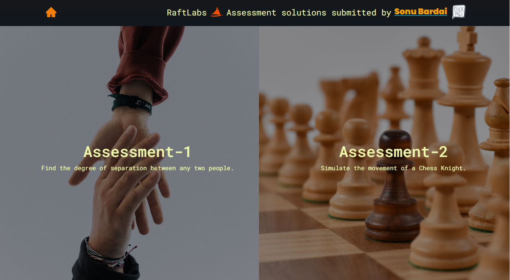
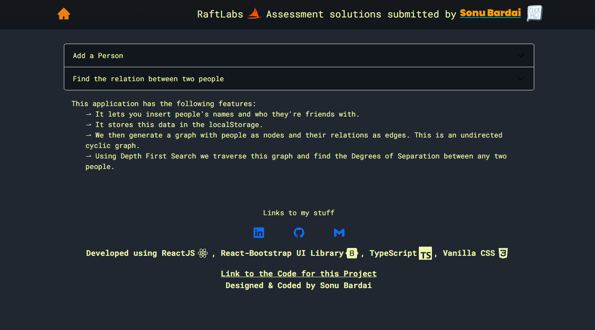
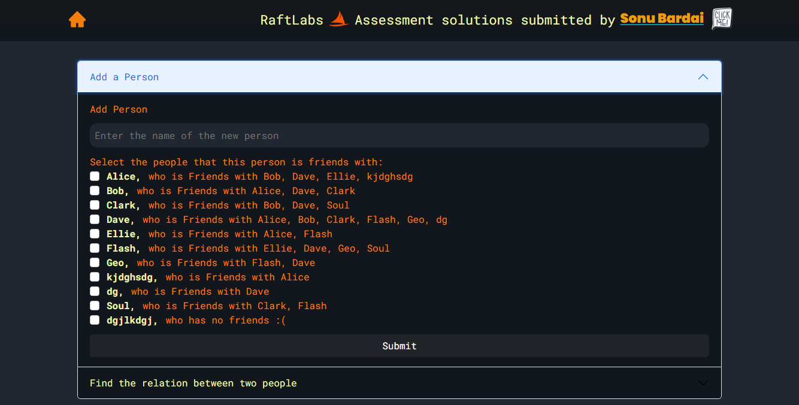
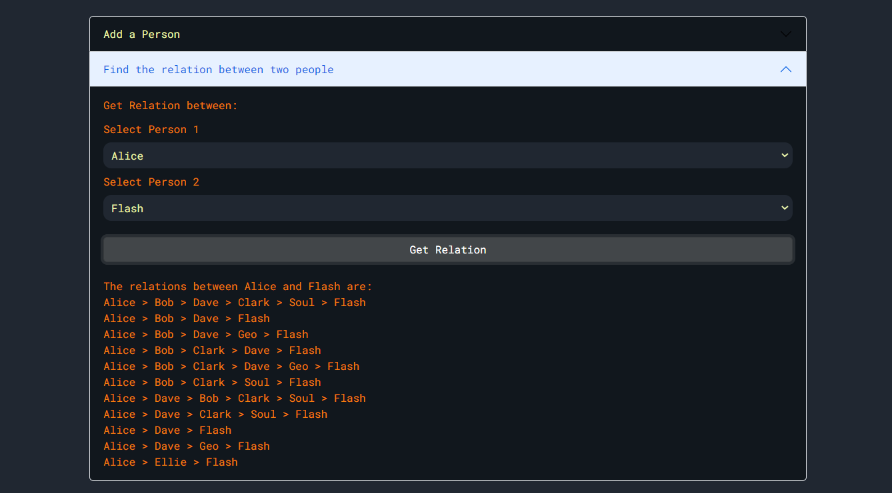
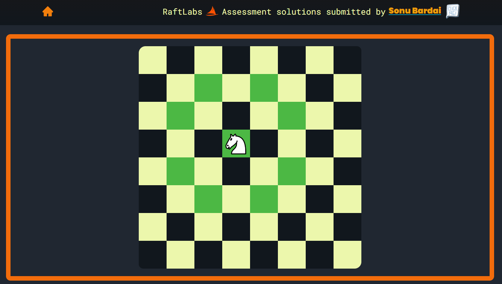
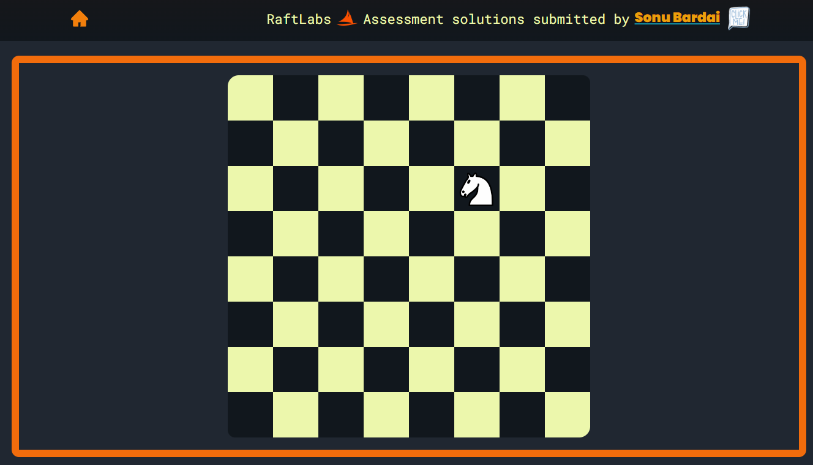

# This is the RaftLabs coding assessment solution. Submitted by Sonu Bardai.

# Setup:

-   `npm install`
-   `npm start`

# Tech Used:

-   ReactJS
-   TypeScript
-   React-Bootstrap UI Library
-   CSS

# Screenshots: 

